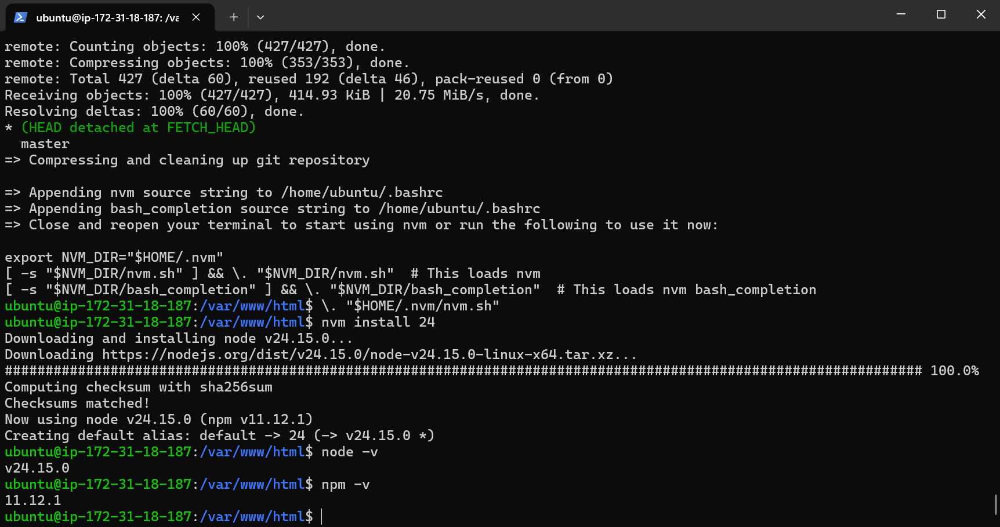
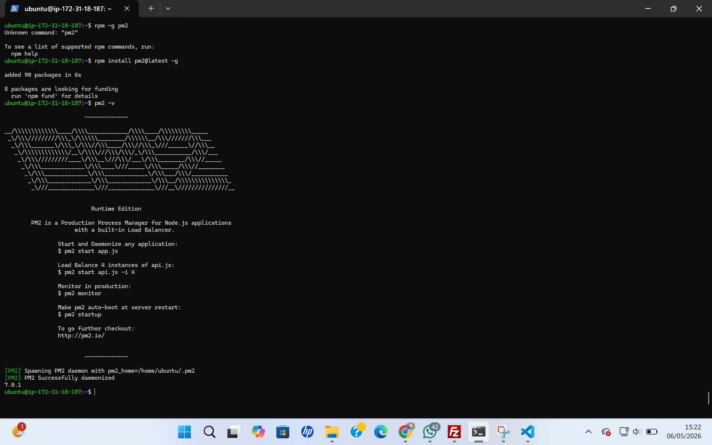
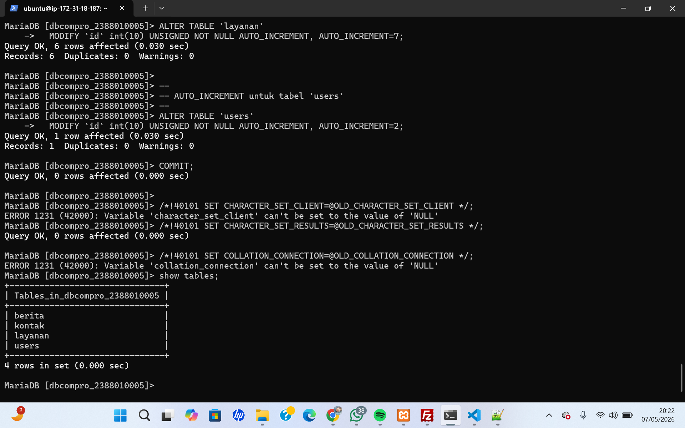
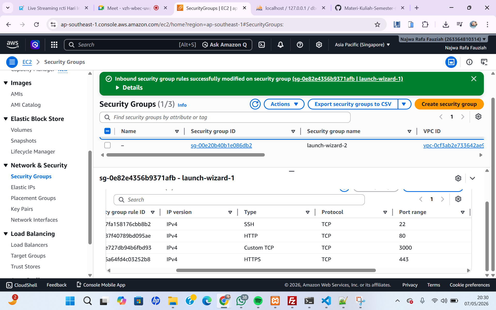
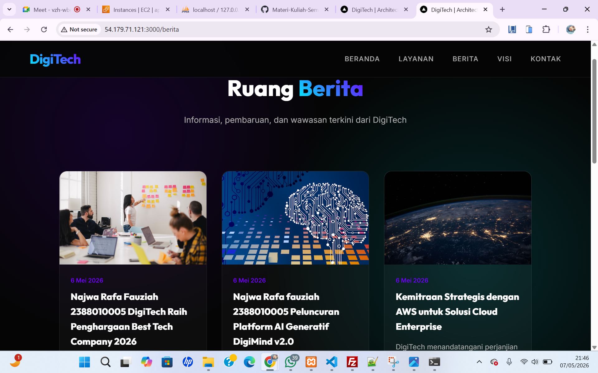

# Migration stanalone folder to instance aws ec2

1. upload standalone.zip via SFTP (Filezilla)
2. konek open ssh -> ssh -i nama_file.pem ubuntu@[ip_address]
- patching os -> sudo apt update && sudo apt upgrade
3. install tools unzip -> sudo apt install unzip -y
4. cd /var/www/html
5. extract standalone.zip -> unzip standalone.zip
6. cek hasil extract -> ls -R / dari filezilla
7. install interpreter untuk apps base node js sesuai dokumentasi resmi https://nodejs.org/en/download
- curl -o- https://raw.githubusercontent.com/nvm-sh/nvm/v0.40.4/install.sh | bash
- \. "$HOME/.nvm/nvm.sh"
- nvm install 24
- node -v
- npm -v

- Install pm2 untuk session state -> npm 
- install pm2@latest -g
pm2 -v

8. Export - Import DB
- Start DBMS (Laragon, xampp, dll)
- Export db_compro
- Hapus ENGINE=InnoDB DEFAULT CHARSET=utf8mb4 COLLATE=utf8mb4_0900_ai_ci
- Login usercompro
- use dbcompro_NIM;
- Copy Paste Query ctrl+A file sql export -> Klik Kanan di terminal AWS -show tables;

9. Kita sesuaikan file .env
- cd standalone
- sudo nano .env
- sesuiakn isi .env : DB_HOST=[IP_ADDRESS] DB_USER=usercompro_NIM DB_PASS=[PASSWORD] DB_NAME=dbcompro_NIM
- ctrl+x -> y -> Enter

10. pm2 start server.js

11. tambah / buka port 3000 di AWS Security Groups

12. Akses http://[IP_ADDRESS]:3000

13. akses BE http://[IP_ADDRESS]:3000/admin edit berita ke 2 tambahkan nama - nim
