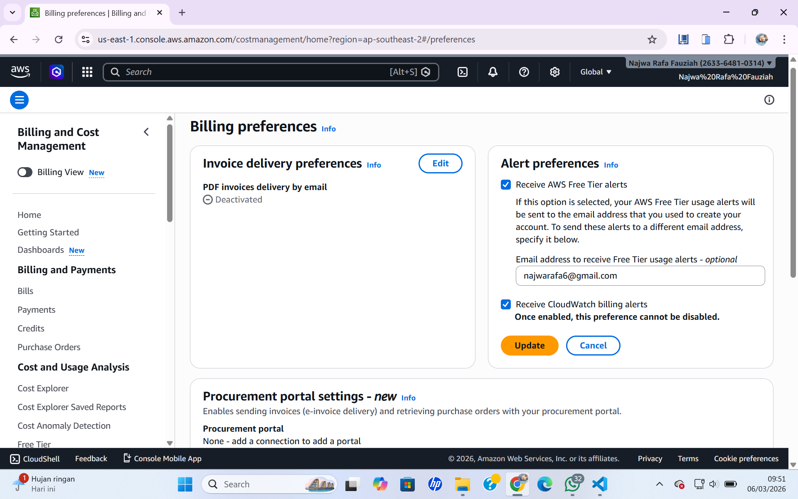
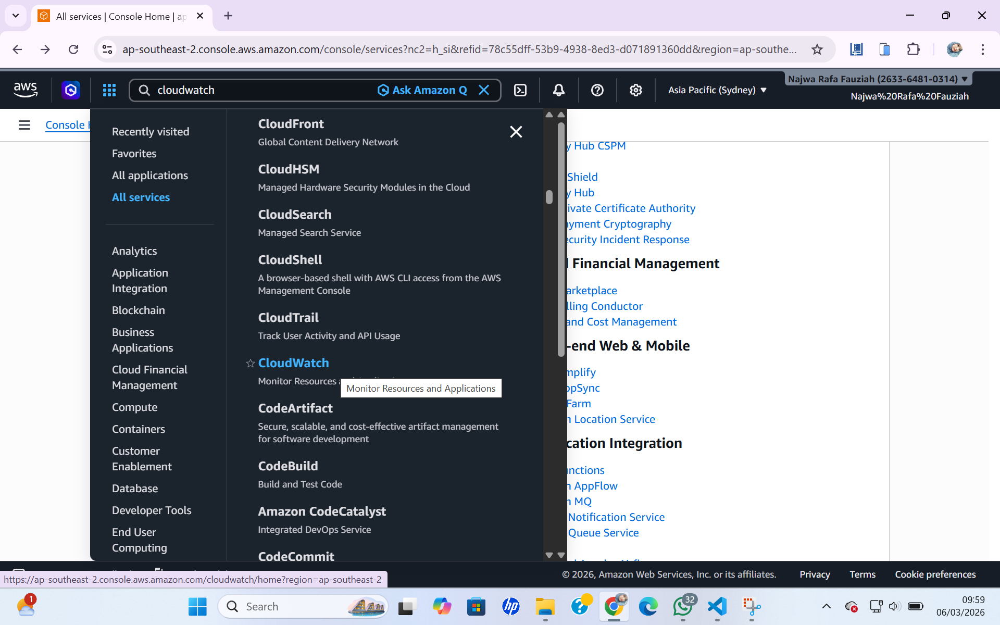
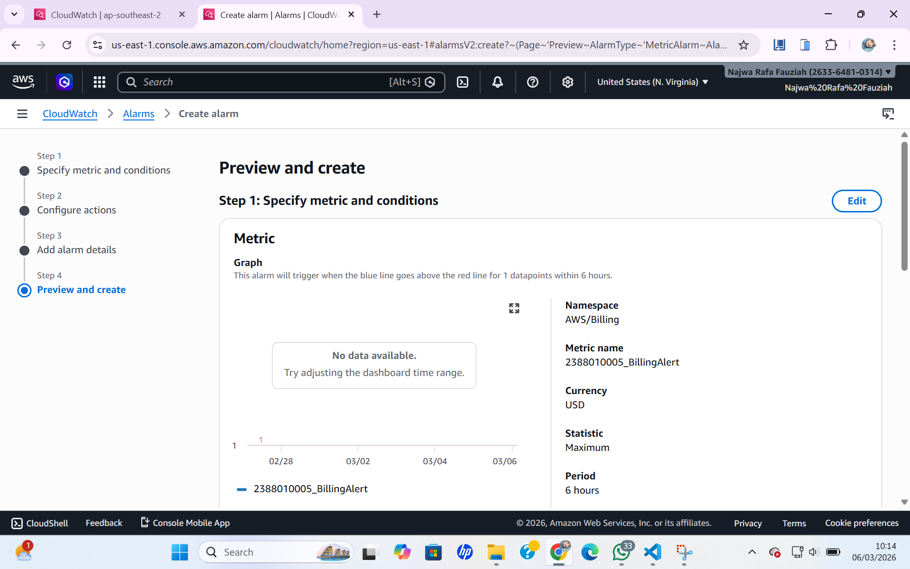
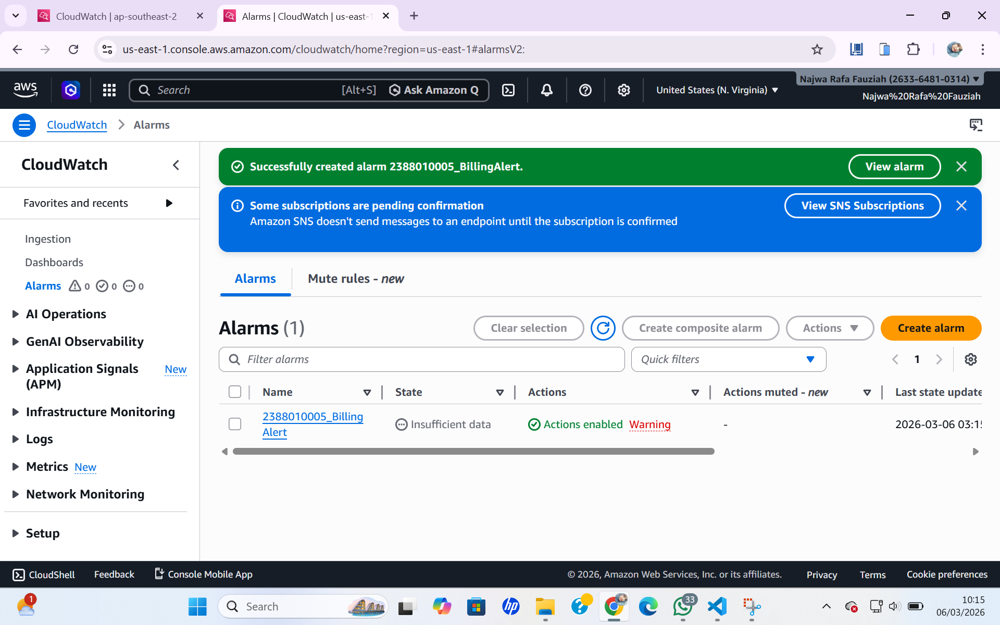

#membuat billing alert di AWS untuk menghindari kelebihan alokasi dana

1. menu dashboard aws kita pilih billing preference untuk mengaktifkan alert.
- masuk menu billing and cost manajemen.
- pada menu cost manajemen scroll kebawah pilih billing .preferences.
- pilih menu alert preference klik edit.
- isi email ceklis receive.
- klik update.

 

2. masuk menu cloudwatch
- pilih all service, pilih cloudwatch

3. pilih menu create alarm
- pastikan region ada di us n virginia
- klik menu create alert
- klik matric
- klik menu billing
- pilih menu total estimated charge
- pilih/ceklis mata uang usd
- klik select metric
- beri nama alert = nim_billingalert
- confditions static-greathertha- 1 usd
- create new topic-nim_billingalert
- Klik Next
- alarm Name -> NIM_BillingAlert
- Create Alarm
- Buka Inbox/Spam dari AWS kemudian klik confirm

