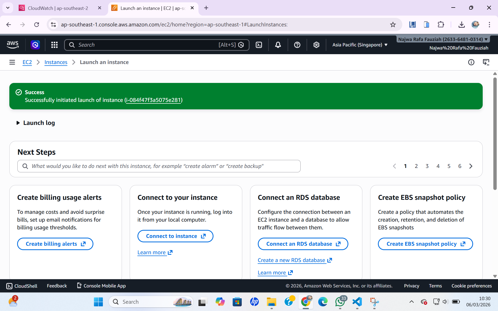
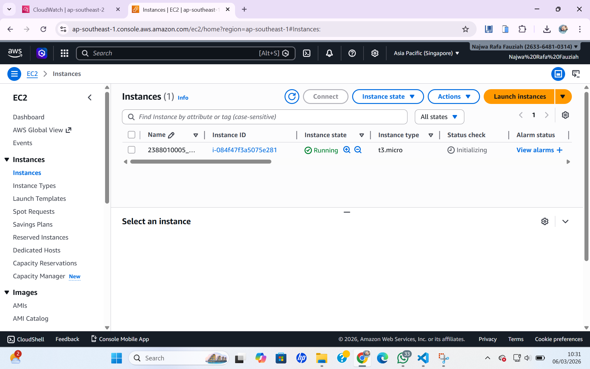

#membuat vm/instance di aws EC2 dgn AMI

1. Buka menu EC2 dari dashboard
2. Klik Menu Launch Instance
3. Pastikan Region memilih terdekat
4. Isi nama Instance -> NIM_Server6A
5. Os pilih Linux Ubuntu
6. Instance Type pilih T3,Micro
7. MembuatKeypair -> Create new Keypair -> Isi nama -> file .Pem -> Pilih Create
8. Network Security
- Allow Allow SSH traffic from
- Allow HTTP
- Allow HTTS
9. Storage setting -> 30gb
10. Klik Launch Instance
11. Pastikan Alert Sukses

12. Pastikan nama sesuai -> klik Instance

