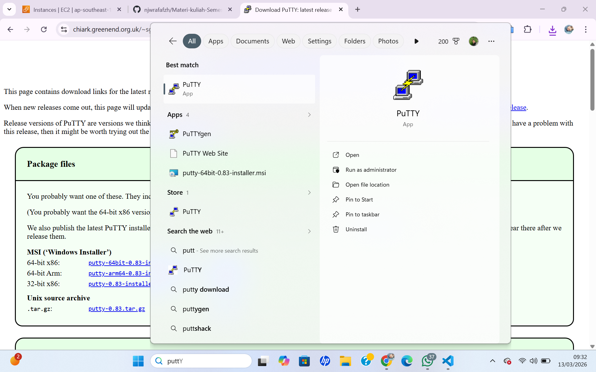
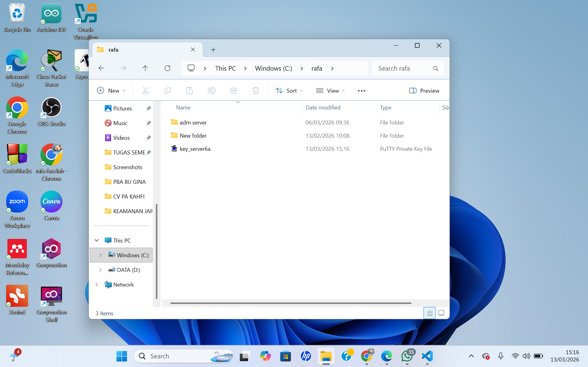
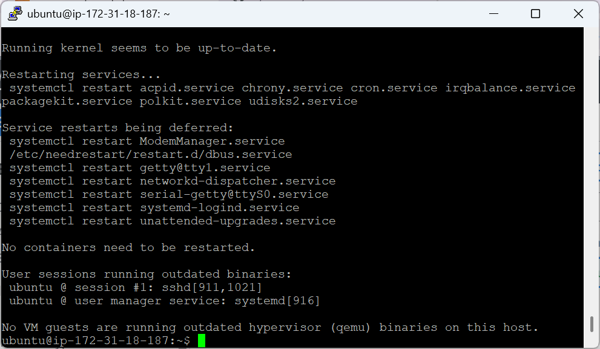
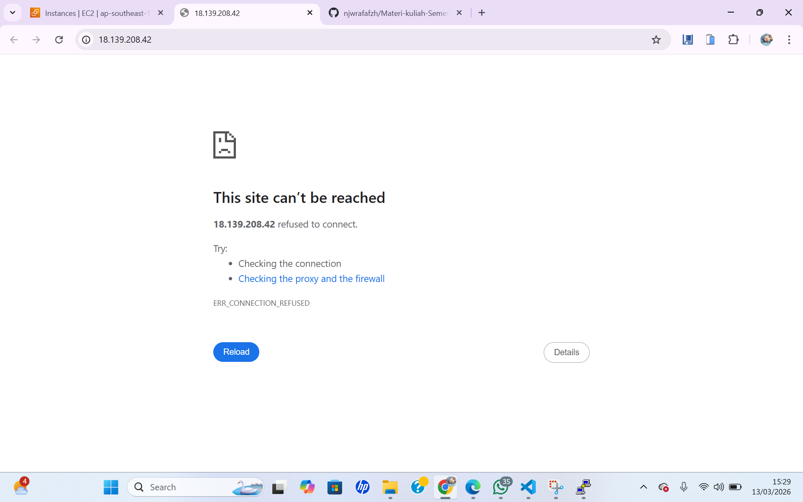
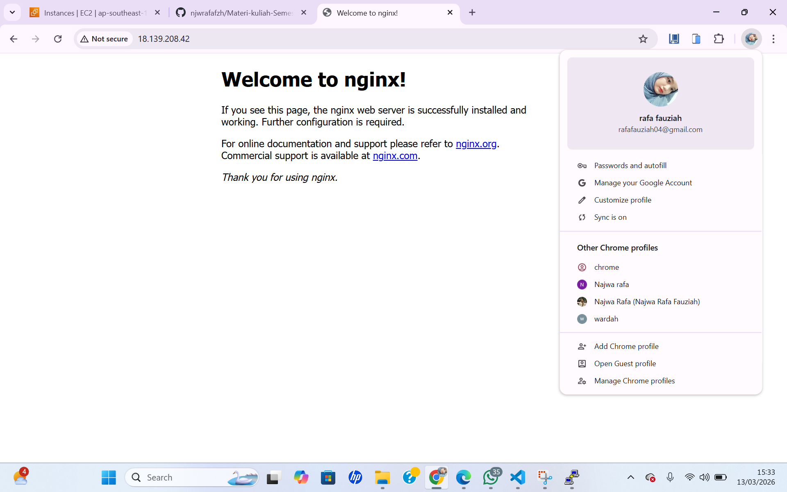

#remote SSH dari AWS AC2 server

1. unduh dan install putty di https://www.chiark.greenend.org.uk/~sgtatham/putty/latest.html

2. konversi ekstensi private key dari .pem menjadi .ppk
- buka putty gen
- load private key .pem
- klik save private key menjadi ekstensi file .ppk

3. setting-up remote SSH dengan putty
- isi Ipv4 addres public data berasal dari instance masing2
- port SSH (22)
- load private key .ppk di menu connection->auth->credential
- user dari instance masing2

4. setiap awal remote kita lakukan patching OS 
- sudo apt-get update && sudo apt-get upgrade

5. coba lakukan instalasi web server
- dalam keadaan kosong

- install salah satu web server
sudo apt install nginx

