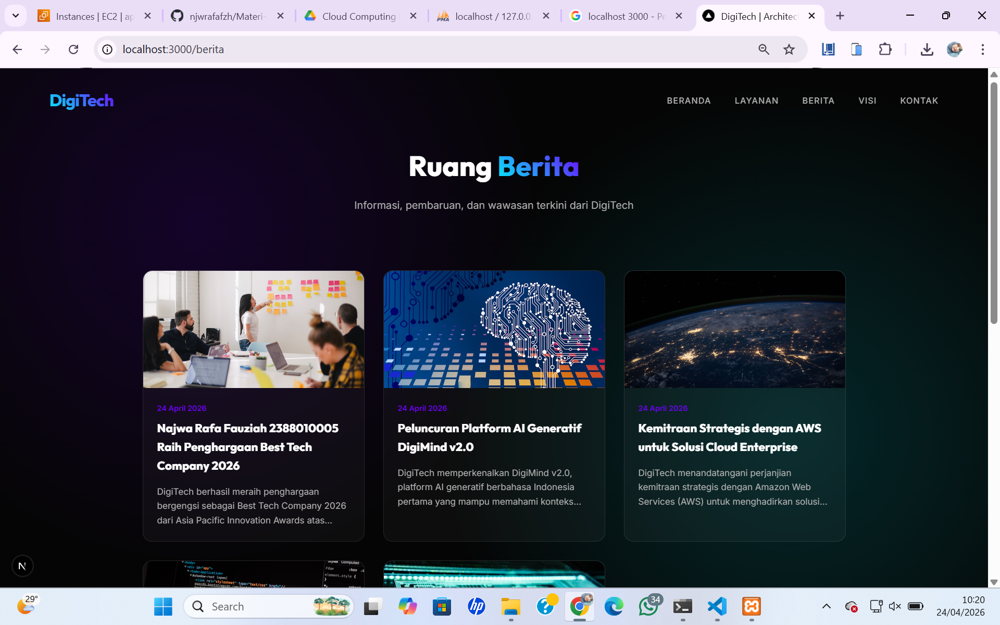

# deploy web apps framework next.js ke aws

1. pastikan web apps berjalan di local
- install dependensi npm install
- create db dan import sql
- create file .env dan isi sesuaikan dengan db local
- jalankan web apss -> npm run dev
- akses web apps di browser http://localhost:3000
- testing front pastikan tampilan muncul dan tanpa error
- testing backend http://localhost:3000/admin
    username: admin
    pass    : admin123

- create static file -> npm run build
- archive folder standalone -> compressed (zipped) folder

